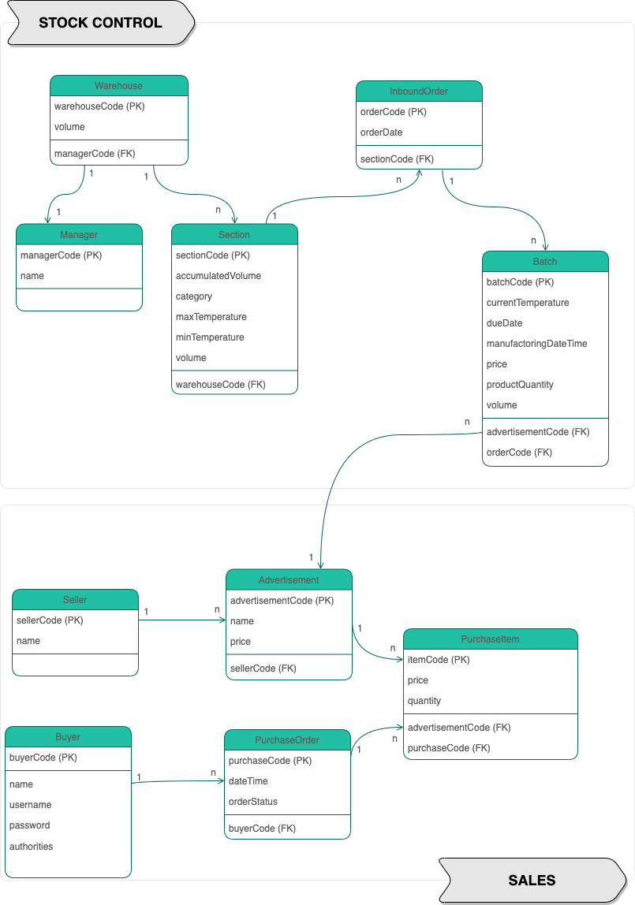

<div align="center">
  
</div>


# Projeto Integrador - Grupo 08

O objetivo deste projeto final é implementar uma API REST no âmbito do slogan e aplicar os conteúdos trabalhados durante o BOOTCAMP MELI. (Git, Java, Spring, Banco de Dados, Qualidade e Segurança).

Hoje a MELI já vende produtos alimentícios, mas quer se aventurar a poder vender produtos que precisam de refrigeração; chamados produtos frescos. Implica novos desafios na forma de armazenar, transportar e comercializar os produtos, uma vez que é feito de uma forma totalmente diferente. O modelo de negócio atualmente implementado em relação à forma como tratamos os nossos produtos (armazenamento, transporte e comercialização) é incompatível com os produtos frescos da indústria alimentar, portanto temos o desafio de cumprir estes novos requisitos de forma a atender às necessidades deste novo mercado.

Desse modo, a meta desse projeto é simular utilizando Spring e em menor escala o possível back-end para o cenário descrito acima.


## :busts_in_silhouette: Autores

- Heitor Guedes ([@heitorsguedes](https://www.github.com/heitorsguedes))
- Lucas Gonçalves ([@LucasVG97](https://www.github.com/LucasVG97))
- Matheus Kaffka ([@matkaf](https://www.github.com/matkaf))
- Matheus Bruder ([@matheusbruder](https://www.github.com/matheusbruder))
- Natalia Souza ([@natalia-ssouzaml](https://www.github.com/natalia-ssouzaml))

## :sparkles: Funcionalidades

Seu desafio é nos ajudar a continuar democratizando o comércio eletrônico e transformando
a LATAM, criando os artefatos necessários para permitir as seguintes funcionalidades:

- Ser capaz de inserir um lote de produtos no armazém de distribuição para registrar essa existência no estoque.
- Ter as informações necessárias para entender em que setor deve ser armazenada a mercadoria para que fique em bom estado enquanto estiver no almoxarifado e para que se possa mostrar ao colaborador que vai procurar o produto (picking) onde está .
- Ser capaz de detectar se há produtos que estão prestes a expirar para tomar alguma medida a esse respeito (poder devolvê-los ao Vendedor, jogá-los fora ou realizar alguma ação comercial específica para liquidá-los).
- Para poder consultar o estoque, listar quais produtos estão em qual armazém e dado um produto específico, entender também em qual armazém ele está armazenado.
- Poder cadastrar o pedido de compra para que os colaboradores dentro do Fullfilment possam montar o (s) pedido (s) para despachá-los.


## :sparkles: Funcionalidade extras:

Cadastrar um Buyer e fazer login.


## :pencil: Modelagem UML




## :books: Documentação da API

<details>
    <summary><h3> Requerimento 1</h3></summary>

#### Create Inbound Order

```http
  POST localhost:8080/api/v1/fresh-products/inboundorder
```

###### **@RequestBody**

```json
{
  "sectionCode": 2,
  "warehouseCode": 1,
  "batchStock": [
    {
      "advertisementCode": 1,
      "currentTemperature": -20.0,
      "productQuantity": 54,
      "manufacturingDateTime": "2022-11-18T15:35:00",
      "volume": 10,
      "dueDate": "2023-01-25",
      "price": 30.0
    },
    {
      "advertisementCode": 2,
      "currentTemperature": -20.0,
      "productQuantity": 99,
      "manufacturingDateTime": "2022-11-18T15:35:00",
      "volume": 5,
      "dueDate": "2023-01-25",
      "price": 45.0
    }
  ]
}
```

#### Update Inbound Order

```http
  PUT localhost:8080/api/v1/fresh-products/inboundorder
```

###### **@RequestBody**

```json
{
  "sectionCode": 2,
  "warehouseCode": 1,
  "orderCode": 12,
  "batchStock": [
    {
      "batchCode": 15,
      "advertisementCode": 1,
      "currentTemperature": -20.0,
      "productQuantity": 40,
      "manufacturingDateTime": "2022-11-01T21:34:56",
      "volume": 10,
      "dueDate": "2023-01-27",
      "price": 60.0
    },
    {
      "batchCode": 16,
      "advertisementCode": 2,
      "currentTemperature": -20.0,
      "productQuantity": 60,
      "manufacturingDateTime": "2022-11-01T21:40:27",
      "volume": 15,
      "dueDate": "2023-01-27",
      "price": 200.0
    }
  ]
}
```

</details>

<details>
    <summary><h3> Requerimento 2</h3></summary>


#### List All Advertisements

```http
  GET localhost:8080/api/v1/fresh-products/
```


#### List All Advertisements by Category

```http
  GET localhost:8080/api/v1/fresh-products/list/${category}
```
| Parâmetro  | Tipo     | Descrição                                                                      |
|:-----------|:---------|:-------------------------------------------------------------------------------|
| `category` | `string` | **Obrigatório**. A categoria que você quer: *Refrigerado, Fresco ou Congelado* |


#### Create Purchase Order apenas se o buyer estiver autenticado.

```http
  POST localhost:8080/api/v1/fresh-products/orders
```

###### **@RequestBody**

```json
{
  "buyerCode": 1,
  "purchaseItems": [
    {
      "advertisementCode": 1,
      "quantity": 50
    },
    {
      "advertisementCode": 2,
      "quantity": 10
    }
  ]
}
```

#### List Advertisements by Purchase

```http
  GET localhost:8080/api/v1/fresh-products/orders/${purchaseCode}
```
| Parâmetro      | Tipo  | Descrição                                                  |
|:---------------|:------|:-----------------------------------------------------------|
| `purchaseCode` | `int` | **Obrigatório**. O código da ordem de compra que você quer |


#### Change Purchase Order Status apenas se o buyer estiver autenticado.

```http
  PUT localhost:8080/api/v1/fresh-products/orders/${purchaseCode}
```
| Parâmetro      | Tipo  | Descrição                                                            |
|:---------------|:------|:---------------------------------------------------------------------|
| `purchaseCode` | `int` | **Obrigatório**. O código da ordem de compra que você quer finalizar |

</details>

<details>
    <summary><h3> Requerimento 3</h3></summary>

#### List Advertisements by Batch

```http
  GET localhost:8080/api/v1/fresh-products/list/advertisement?advertisement=${advertisementCode}&order=${orderParam}
```
| Parâmetro       | Tipo     | Descrição                                                                                                         |
|:----------------|:---------|:------------------------------------------------------------------------------------------------------------------|
| `advertisement` | `int`    | **Obrigatório**. O código do anúncio que você quer                                                                |
| `order`         | `string` | **Opcional**. O tipo de ordenação que deseja aplicar: *V = Data validade ou Q = Quantidade ou L = Número do Lote* |

</details>

<details>
    <summary><h3> Requerimento 4</h3></summary>


#### Count Advertisement By Warehouse

```http
  GET localhost:8080/api/v1/fresh-products/list/warehouse?advertisement=${advertisementCode}
```
| Parâmetro       | Tipo  | Descrição                                          |
|:----------------|:------|:---------------------------------------------------|
| `advertisement` | `int` | **Obrigatório**. O código do anúncio que você quer |

</details>

<details>
    <summary><h3> Requerimento 5</h3></summary>

#### Find All Batch By Sector And DueDate

```http
  GET localhost:8080/api/v1/fresh-products/due-date?days=${numberDays}&section=${sectionCode}
```
| Parâmetro    | Tipo  | Descrição                                                     |
|:-------------|:------|:--------------------------------------------------------------|
| `numberDays` | `int` | **Obrigatório**. O número de dias que você quer fazer a busca |
| `section`    | `int` | **Obrigatório**. O código da seção que você quer              |


#### Find All Batch By Category And DueDate

```http
  GET localhost:8080/api/v1/fresh-products/due-date/list?days=${numberDays}&category=${category}&order=${orderParam}
```
| Parâmetro    | Tipo     | Descrição                                                                                      |
|:-------------|:---------|:-----------------------------------------------------------------------------------------------|
| `numberDays` | `int`    | **Obrigatório**. O número de dias que você quer fazer a busca                                  |
| `category`   | `string` | **Obrigatório**. A categoria que você quer: *Refrigerado, Fresco ou Congelado*                 |
| `order`      | `string` | **Opcional**. O tipo de ordenação que deseja aplicar: *asc = ascendente ou desc = descendente* |

</details>
<details>
  <summary><h3> Requerimento 6 </h3></summary>
  
  #### Create new Buyer

```http
  POST localhost:8080/api/v1/fresh-products/buyer/new
```

###### **@RequestBody**

```json
{
	"name": "Seu nome",
	"username": "Seu email",
	"password": "Sua senha"
}
```
  
  #### Login Buyer

```http
  POST localhost:8080/api/v1/fresh-products/buyer/login
```
###### **@RequestBody**

```json
{
	"username": "Seu email",
	"password": "Sua senha"
}
```

</details>


## :file_folder: Download Endpoints

- [Collection (endpoints)](src/main/resources/projeto-integrador.postman_collection.json)

- [Collection (endpoints com requisito 6)](src/main/resources/projeto-integrador-requisitoextra.json) 

